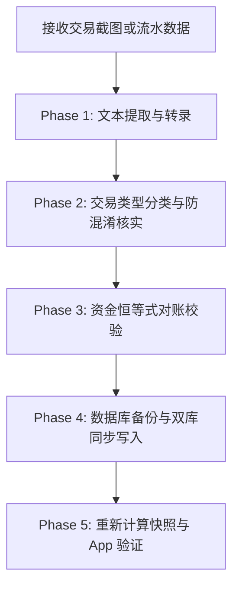

# 资产与交易流水深度分析指南 (Portfolio Transaction Analysis)

本 Skill 沉淀了分析券商/银行流水截图（如汇丰 Trade25、富途、老虎、盈透等）与 CareAssets 本地 `transactionhistory` 数据库的实战经验，确保资金对账清晰、本金不虚高、双库同步安全。

---

## 核心任务流 (Standard Operating Procedure)



---

## 1. 核心概念与防混淆准则

在处理用户对“为什么累计投入达到 XX，实际本金只有 XX”的疑问时，必须严格区分以下指标：

1. **净投入本金 (Net Deposited)**：
   - 外部存入账户的真实真金白银：$$\sum \text{外部入金} - \sum \text{外部出金}$$。
   - 对应 `kind = 'deposit'` / `'withdrawal'`。
2. **累计买入 (Gross Invested)**：
   - 历史所有买入股票的总成交金额与税费：$$\sum (\text{成交额} + \text{税费})$$。
   - **关键认知**：股票卖出后的回笼资金再次买入其他股票，会累加进累计买入，但**绝不增加外部本金**（即周转率资金）。
3. **货币兑换 (FX Exchange)**：
   - 账户内不同币种之间的划转（如 CNY -> USD）。
   - **防混淆红线**：换汇必定有成对的双边账目（扣减币种 A，增加币种 B）。**绝不能**把币种 B 录为入金、币种 A 录为出金！必须录为单一的 `kind = 'exchange'`。
4. **对账恒等式**：
   $$\text{总资产 (Net Worth)} - \text{净投入本金 (Net Deposited)} = \text{累计总盈亏 (Total PnL)}$$

详细分类手册请参考：[reconciliation-rules.md](./references/reconciliation-rules.md)。

---

## 2. 交易截图解析五步法

当用户上传券商或网银截图（如汇丰 Trade25 结单）时：

### Step 1: 逐笔转录完整明细
- 提取每笔记录的：交易日期、借贷方向（Debit / Credit）、币种、金额、交易描述与单据流水号（如 `HC1262...`、`N5294...`）。

### Step 2: 自动配对换汇记录 (FX Matching)
- 扫描同日期或相近时间戳下，金额方向相反、且带有相同兑换凭证号的双边账目；
- 合并为单一 `exchange` 记录，计算隐式汇率。

### Step 3: 分离非交易损益与杂费
- 分红派息（`CORP EVT PAYMENT SEC`）、活期利息（`CREDIT INTEREST`）归入 `dividend`；
- 存仓/托管费（`CUSTODIAN FEE SEC`）归入费用扣减。

### Step 4: 制定方案并呈报用户审核
- 在写入数据库前，整理为结构化汇总表格；
- 明确汇报：外部入金总计、换汇总额、交易周转总额，供用户最终确认。

---

## 3. 数据库维护与双库安全写入

CareAssets 支持本地与 iCloud Drive 双库同步，执行写入必须遵循严格的安全协议：

### 1. 数据库路径
- **本地数据库**：`~/Library/Application Support/CareAssets/CareAssets.sqlite3`
- **iCloud 同步库**：`~/Library/Mobile Documents/com~apple~CloudDocs/CareAsset/CareAssets-sync.sqlite3`
- **备份目录**：`~/Library/Application Support/CareAssets/backups/`

### 2. 强制备份规范
在执行写入操作前，必须使用 `shutil.copy2` 生成带时间戳的完整备份：
```bash
CareAssets_backup_YYYYMMDD_HHMMSS.sqlite3
```

### 3. 数据表结构与规范
数据存入 `transactions` 表，详细字段类型、枚举定义与 Python 脚本模版请参考：[database-schema.md](./references/database-schema.md)。

---

## 4. 自动化审计工具

本项目内置了自动化数据审计脚本，用于校验数据逻辑一致性与双库同步状态：

```bash
# 运行流水审计与对账检查
.agents/skills/portfolio-transaction-analysis/scripts/audit_transactions.py
```

### 审计检查点包括：
1. 各类型流水（buy, sell, deposit, withdrawal, exchange, dividend）笔数统计；
2. 各币种净投入本金精确求和；
3. 换汇记录成对性与平均汇率合理性；
4. 股票买卖累计成交与手续费；
5. 异常记录筛查（负数金额、缺少股票代码的交易、缺失目标币种的换汇）；
6. 本地与 iCloud 云盘数据库记录总数双向校验。
